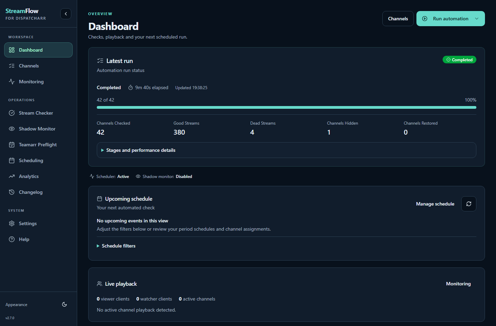
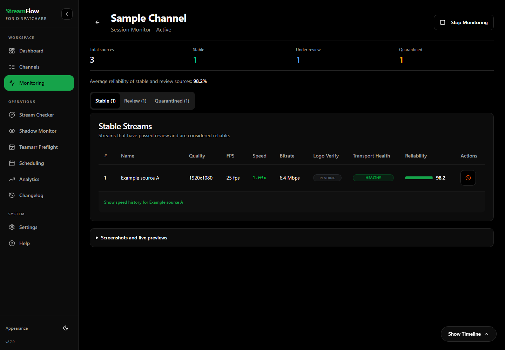

# StreamFlow

[](https://github.com/krinkuto11/streamflow/releases/latest) [](https://github.com/krinkuto11/streamflow/actions/workflows/tests.yml?query=branch%3Amain) [](https://github.com/krinkuto11/streamflow/actions/workflows/ci.yml?query=branch%3Adev) [](LICENSE) 

Automated IPTV stream management for Dispatcharr. StreamFlow refreshes playlists,
matches streams to channels, checks measured stream quality and writes the chosen
stream order back to Dispatcharr. Run the steps manually or schedule them with
profiles for individual channels and groups.



## Features

- **Profiles and schedules:** independently control playlist refresh, stream matching and quality checks; assign interval, cron or EPG-based schedules.
- **Stream matching:** regex and TVG-ID matching, provider filters and priorities, previews, validation and bulk pattern assignment.
- **Quality checks:** FFmpeg/ffprobe measurements for bitrate, resolution, frame rate, codec and HDR; configurable scoring, reordering and optional blank/freeze detection.
- **Capacity and recovery:** provider/profile stream limits, active-viewer protection, queue progress, dead-stream tracking, quarantine and revival.
- **Teamarr Event Preflight:** optional checks of streams already assigned to Teamarr-managed event channels, with configurable checks before and after an event starts. Teamarr remains responsible for event matching.
- **Stream Monitoring:** monitoring sessions with source health, reliability, screenshots, speed history and a timeline. Supported AceStream sources can use optional OpenStream API monitoring.
- **Shadow Monitor:** optional viewer-side monitoring and recovery for active channels, with its own watcher identity and channel scope.
- **Playback stability history:** optionally record delivery stalls and source switches from existing Dispatcharr viewer sessions without opening another provider connection; persist history and opt selected profiles into stability-based score deductions.
- **Dashboard and analytics:** run stages, checked/good/dead/hidden/restored counters, schedules, playback status and historical charts.
- **Appearance and Help:** responsive desktop/mobile navigation, Light/Dark/Auto/Matrix appearance, and in-app operator guides with setting locations.
- **Hardware and API:** CPU probing by default, optional supported hardware acceleration with CPU fallback, and a REST API.

<details>
<summary>Preview monitoring in Matrix appearance</summary>



</details>

Screenshots use example data. See the [2.7.0 release notes](docs/release-2.7.0.md)
for the current stable release and the [changelog](CHANGELOG.md) for subsequent changes.

## Requirements

- A running Dispatcharr instance reachable from the StreamFlow container, with an API key or username/password credentials.
- Docker and Docker Compose for the installation below.
- Optional: Teamarr for event preflight, or an OpenStream server for OpenStream monitoring sessions.

Dispatcharr is available in Unraid Community Applications.

## Install StreamFlow

The supplied Compose file uses the stable image and exposes StreamFlow on port
`5000`. Before starting, review the host port and the persistent data path in
[`docker-compose.yml`](docker-compose.yml). The host directory mounted at
`/app/data` must be writable and holds the database, settings and history.

```bash
git clone https://github.com/krinkuto11/streamflow.git
cd streamflow
touch .env
# Review ports and the /app/data volume in docker-compose.yml.
docker compose up -d
```

The Compose file requires `.env`; an empty file is enough when configuring the
Dispatcharr connection through the UI. Open **http://localhost:5000**, or use the
Docker host's address and your configured port when connecting remotely.

| Image | Purpose |
| --- | --- |
| `ghcr.io/krinkuto11/streamflow:latest` | Current stable release |
| `ghcr.io/krinkuto11/streamflow:2.7.0` | A specific stable release |
| `ghcr.io/krinkuto11/streamflow:dev` | Development builds; review changes before updating |

To update the image selected in your Compose file:

```bash
docker compose pull
docker compose up -d
```

Keep a backup of the persistent data directory before updating.

### Unraid

An [Unraid DockerMan template](templates/streamflow.xml) is provided with a
persistent Appdata path, an editable host port and Unraid user/group defaults.
See the [Unraid installation guide](docs/unraid.md). Community Applications
listing is pending submission and review.

## First setup

1. Complete StreamFlow's setup wizard with a Dispatcharr **Base URL** and **API Key**, or **User / Pass**. Use an address reachable from the container; `localhost` inside it refers to StreamFlow itself. Later connection changes are under **Settings → Connection → Dispatcharr Connection**.
2. Configure the steps you need under **Settings → Profiles**. Add schedules under **Settings → Periods** and assign them to channels or groups from **Channels**.
3. Configure matching patterns if needed, then start a check manually and inspect its results before enabling scheduled removal or other destructive profile actions.
4. Enable optional integrations only when needed. OpenStream credentials are under **Settings → Connection → OpenStream**; Teamarr is configured on **Teamarr Preflight**.

Playback stability recording and its use in profile scoring both default to
**off**. Collection is under **Settings → Monitoring → Playback Stability →
Record Playback Stability**. To use collected evidence, edit a profile under
**Settings → Profiles → Stream Checking → Stream Quality Scoring → Use Playback
Stability**. Sources without enough history retain their existing quality score.

For setup, capacity, hardware and troubleshooting details, use the in-app
**Help** page or the [operations guide](docs/operations-guide.md).

## Documentation

| Guide | Contents |
| --- | --- |
| [Operations](docs/operations-guide.md) | Setup, authentication, capacity, hardware, Shadow Monitor, Teamarr Preflight and troubleshooting |
| [Automation](docs/automation.md) | Profiles, periods, channel/group assignments and EPG schedules |
| [Stream matching](docs/stream-matching.md) | Regex, TVG-ID, provider priorities, bulk assignment and validation |
| [Stream checking](docs/stream-checking.md) | Measurements, scoring, dead streams and concurrency limits |
| [Stream monitoring](docs/stream-monitoring.md) | Sessions, source reliability, timelines, screenshots and OpenStream |
| [Playback stability](docs/dev-playback-stability-changelog-20261007.md) | Optional passive history, scoring, settings and measurement limits |
| [Matrix appearance](docs/matrix-theme.md) | Palette, appearance selection and validation |
| [REST API](docs/API.md) | API reference |
| [Development](DEVELOPMENT.md) | Local development and tests |
| [Dependency management](docs/dependency-management.md) | Dependabot policy, review checks and lockfile maintenance |
| [Unraid](docs/unraid.md) | DockerMan installation, persistent storage, updates and Community Applications submission |
| [Changelog](CHANGELOG.md) | Release changes |

## License

[Apache License 2.0](LICENSE).
