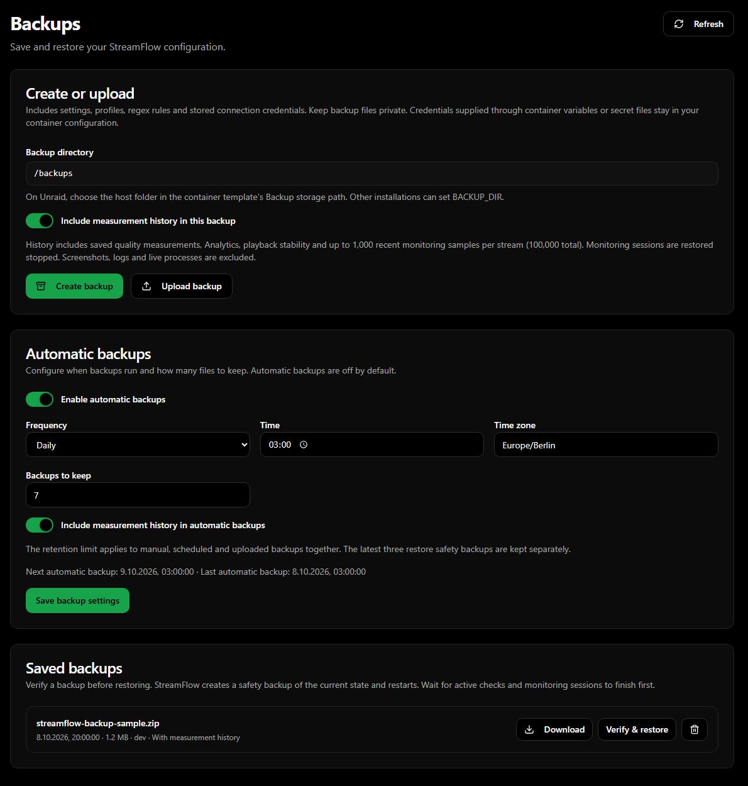
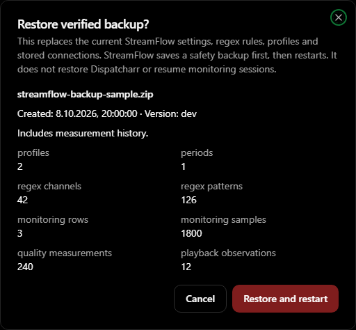
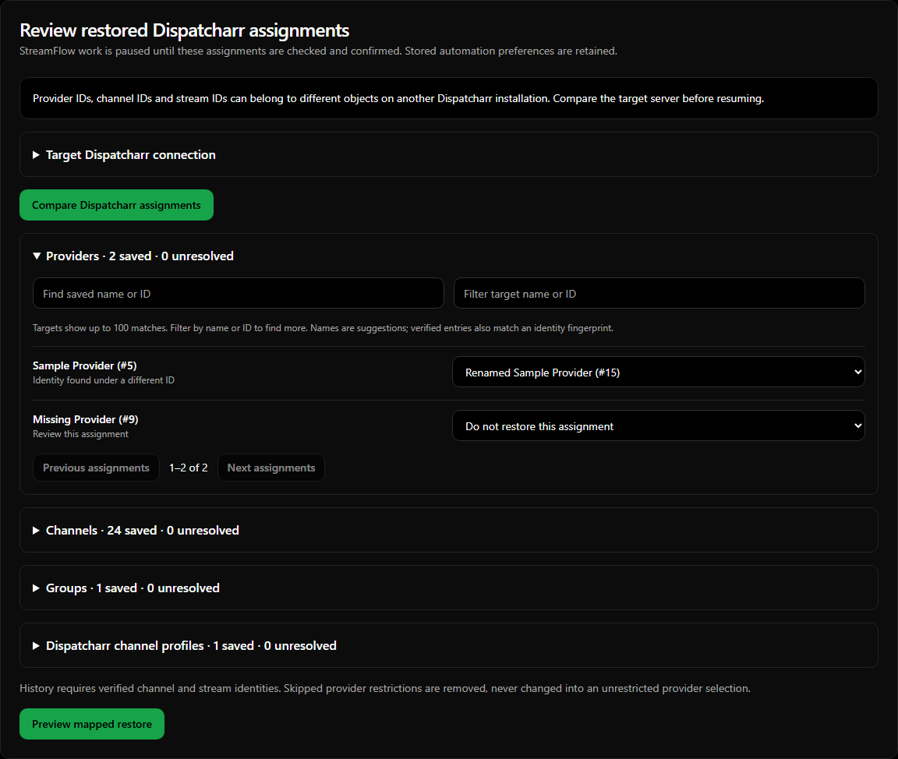
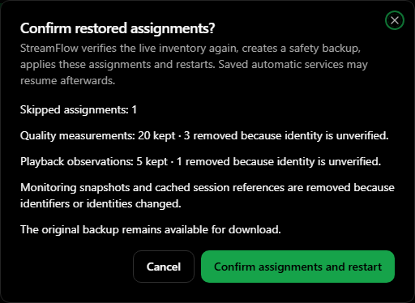

# Backup and restore

Available on `dev`. Open **Backups** in the sidebar’s **System** section. A fresh installation also offers **Restore a backup** in the setup wizard, so a working Dispatcharr connection is not required to upload and restore a backup.

Backups page and restore confirmation (sample data)

## Contents

Every archive includes a consistent SQLite snapshot and StreamFlow’s persisted JSON configuration files. This covers settings, Dispatcharr/OpenStream connections saved through the UI, automation profiles and periods, channel/group assignments, regex rules, provider filters/priorities, channel order, webhook configuration, Shadow Monitor and Teamarr Preflight configuration. New backups also capture the initialized Dispatcharr inventory, with hashed provider addresses and stream URLs, to verify identities during restoration. If initialization has not completed, no inventory snapshot is available and the backup needs manual assignment review. The archive does not modify or back up Dispatcharr or Teamarr itself.

**Include measurement history** additionally keeps saved quality telemetry, Analytics run history and passive playback stability observations. Detailed Stream Monitoring timelines normally live in memory; backups capture up to the latest **1,000 samples per stream**, limited to **100,000 samples total**. The snapshot is loaded once after restoration, then follows the existing in-memory lifetime; a later ordinary restart does not reload old measurements. This is a bounded snapshot, not a new continuous recorder. Restored monitoring sessions remain stopped; old PIDs and active flags are cleared. Starting a new monitoring run follows the normal session reset rules.

Configuration-only backups omit the historical run/telemetry/playback tables and monitoring timelines. Cached stream metadata and monitoring configuration remain present. Restoring such a backup replaces the existing historical data with the backup’s empty history.

Screenshots, logs, media files, derived logo caches and nested old migration/backup folders are excluded. Container environment variables, `_FILE` secrets, volume mappings and browser-local appearance preferences are not stored in the archive. External credentials remain managed in the container template or deployment configuration.

Archives contain stored connection credentials and may contain provider URLs. Downloaded files should be kept private. StreamFlow uses private file permissions and does not return those credentials in backup-list or verification-preview responses.

## Manual backup and restore

Identical duplicate cache entries are collapsed in identity metadata. Conflicting, uninitialized or oversized cache inventories are omitted so configuration backups still work; these archives need manual review. Live comparison checks paginated record counts and the complete unique channel/stream ID sets, and remains paused if data is incomplete or changes during fetching.

1. On **Backups → Create or upload**, choose **Include measurement history in this backup** and click **Create backup**. The operation runs in the background; the file appears under **Saved backups** when complete.
2. Download the ZIP for storage elsewhere. **Upload backup** validates an existing StreamFlow ZIP before adding it to the list.
3. Choose **Verify & restore**. StreamFlow checks every file’s size and SHA-256 checksum, allowed archive paths, JSON format, SQLite integrity and supported database schema before showing the confirmation.
4. Click **Restore and restart**. Wait for active stream checks, automation, event preflights, shadow probes and monitoring sessions to finish first. Ordinary backups can run alongside checks; restoration requires idle work.
5. StreamFlow saves a **safety backup** of its current state, replaces the persisted state before opening database connections and restarts itself. The browser reconnects to **Backups**, with automatic work paused for assignment review. Restored automation preferences retain their saved values.
6. Expand **Target Dispatcharr connection** if the destination needs a different address or credentials. External values remain managed through the container template. Click **Compare Dispatcharr assignments** to fetch the current inventory through read-only Dispatcharr API calls.
7. Review the saved provider, channel, group and Dispatcharr channel-profile assignments. An identity match can preselect a renamed or moved object. A name match is only a suggestion; a reused numeric ID alone is never accepted as identity proof. Use the search boxes to find targets, or explicitly select **Do not restore this assignment**. Each target channel/group/profile can be assigned once.
8. Click **Preview mapped restore** and inspect the measurement counts and skipped assignments. **Confirm assignments and restart** fetches the target inventory again, rejects a stale comparison, saves another safety backup and applies the mappings before reopening the database. Saved automatic services can then resume.

Regex expressions, rule order and StreamFlow automation profile/period IDs remain unchanged. Dispatcharr references are remapped separately. If every provider in a restricted regex rule is skipped, that rule is removed. Restricted monitors or automation profiles/periods whose entire inclusion scope is skipped are disabled. A skipped default start channel resets the queue start to **first**. Dropping every provider from the global enabled-provider filter is rejected because an empty filter would broaden automation.

Quality and playback measurements are kept only when the saved channel UUID and stream URL fingerprint match the confirmed target, including its mapped provider ownership. Playback observations additionally need their own stored source fingerprint to agree. Measurements without proof are removed from the restored working database; the original archive remains available. Changed stream IDs can preserve verified quality/playback rows through remapping. Stream Monitoring snapshots and cached session references are omitted when identifiers or identities change, since they contain embedded references that cannot be remapped safely. Aggregate Analytics totals remain, while raw run details with old references are cleared for a changed inventory.

Older backups without an identity snapshot remain supported for configuration restoration. They require manual assignment confirmation and cannot attach unverified measurement history to live streams. A successful initial restore does not bypass this review, even if the archive contains a saved review flag. Closing the browser or restarting the container while review is pending keeps automatic work paused.

An interrupted file replacement has a persistent recovery journal. On the next startup StreamFlow rolls back to its previous state before starting services. If rollback itself fails, startup stops and keeps the recovery journal rather than opening mixed state. Inspect the container log and storage before retrying. The last restore result is shown on the Backups page; safety archives can also be selected for restoration.

For a fresh installation, configure the persistent data and backup folders in the container template, open **Restore a backup** in the setup wizard, upload the archive and follow the same verification/confirmation and assignment-review steps. The review screen is available without initializing the restored connection or starting checks. Existing legacy JSON migration files cannot overwrite the restored SQL settings or regex rules.

Only backups written by this format are supported; arbitrary data-directory ZIP files are rejected. Backups from a newer unsupported database schema are rejected. Uploads are limited to 1 GiB compressed / 4 GiB expanded; configuration and monitoring JSON files are separately bounded.

## Automatic backups

Configure **Backups → Automatic backups** and click **Save backup settings**:

| Setting | Default | Behavior |
| --- | --- | --- |
| Enable automatic backups | Off | Explicit opt-in; existing installations remain unchanged |
| Frequency | Daily | Daily, weekly or every N hours |
| Time | 03:00 | Civil time in the selected time zone; used for daily/weekly |
| Day | Monday | Used for weekly schedules |
| Interval (hours) | 24 | 1–168 hours; starts from saving a changed schedule |
| Time zone | UTC | IANA name, for example `Europe/Berlin` |
| Backups to keep | 7 | 1–90 files; manual, scheduled and uploaded archives share this limit |
| Include measurement history | On | Controls automatic backup contents |

The scheduler checks every 30 seconds. After downtime, an overdue backup runs once; the next time is calculated from completion. Failed automatic backups retry after five minutes. Spring daylight-saving times that do not exist are skipped; repeated autumn times run once, using the first occurrence. The latest **three safety backups** are retained separately from the regular limit.

## Storage and Unraid

The default directory is **`$CONFIG_DIR/backups`** (`/app/data/backups` in the supplied container). For separate storage, set the container variable **`BACKUP_DIR=/backups`** and map a persistent writable host folder to `/backups`.

On Unraid, configure this through the ordinary **Docker → StreamFlow → Edit** template:

- Add a **Path** named **Backup storage**, container path `/backups`, your chosen host folder, Read/Write access.
- Add a **Variable** named **Backup directory**, key `BACKUP_DIR`, value `/backups`.
- Apply the template. The Backups page shows the resulting container directory. Change the host destination through this same template path; it is not edited through the application.

StreamFlow’s normal entrypoint prepares this directory for the configured `PUID`/`PGID`. Non-root installations must provide a writable folder themselves. A separate volume can keep archives when the application data is replaced; retain an off-host copy as appropriate.

Compose users can add `BACKUP_DIR: /backups` under `environment` and a volume such as `./backups:/backups`. Without these additions backups remain inside the existing persistent data volume.
