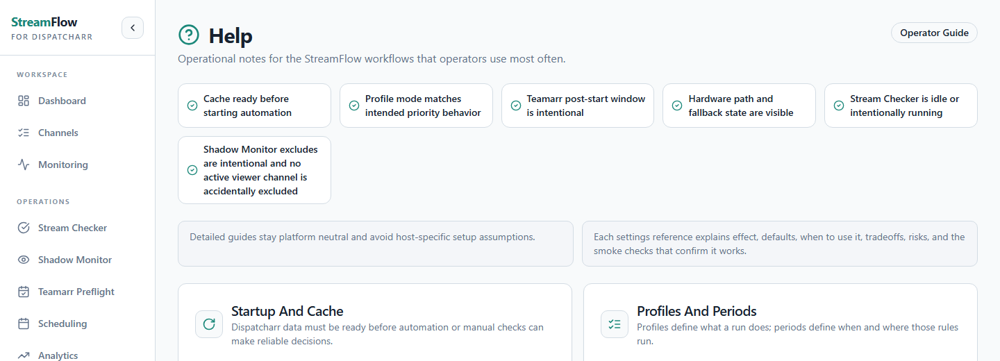
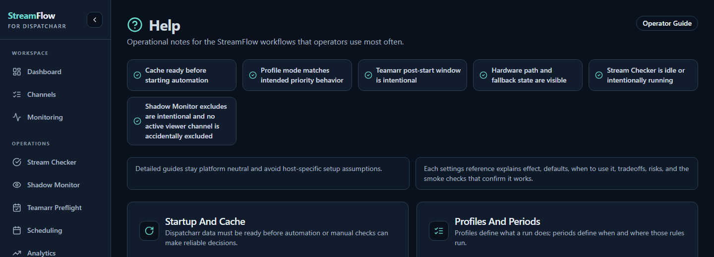
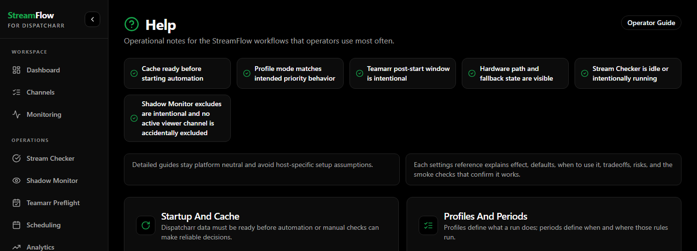

# Frontend security dependency cleanup — development changelog

## 2026-10-07

### Dependency audit

- Replace Tailwind CSS 3.4 with Tailwind CSS 4.3.3 and its dedicated
  `@tailwindcss/postcss` integration. The old dependency chain pulled in
  vulnerable `braces` through `chokidar`, `micromatch`, and `fast-glob`.
- Remove the separate Autoprefixer plugin; Tailwind 4 handles vendor prefixing.
- Upgrade React Router DOM from 6.30 to 7.18.4, covering the reported redirect
  and hydration advisories. Keep the existing browser router and route layout.
- Upgrade `tailwind-merge` to 3.7.0, which supports Tailwind 4 utility names.
- Refresh the transitive `source-map-js` dependency to its patched 1.2.2 version.
- Preserve the existing `tailwindcss-animate` plugin and Radix transition classes.
- Keep the required `npm audit --audit-level=high` workflow unchanged. No audit
  suppression, excluded dependencies, or ignored advisories are introduced.
- Carry forward the existing Werkzeug 3.1.9 and urllib3 2.8.0 security pins into
  both Python lockfiles so this independent branch also passes its backend audit.
  These are the same versions already used by the playback-stability build.

### CSS migration and behavior

- Move the Tailwind configuration into `src/index.css`: existing HSL theme
  variables, custom corner radii, container dimensions, and accordion keyframes.
- Retain the previous sans-serif and monospace font stacks explicitly.
- Migrate deprecated and renamed utility classes, including `shrink-0`,
  `outline-hidden`, `outline-solid`, `shadow-xs`, and `wrap-break-word`.
- Preserve component variant names such as `outline`, monitoring descriptions,
  help content, and historical changelog text. Review the automated migration
  against the source AST so utility rewrites do not alter application data.
- Preserve the existing channel/checker/preflight behavior and stored settings.
- Preserve the Matrix active navigation colors in the utilities cascade layer;
  Tailwind 4 utilities otherwise override the earlier theme-specific base rule.
- Tailwind 4 requires modern browsers: Safari 16.4+, Chrome 111+, Firefox 128+.
  See the [official upgrade guide](https://tailwindcss.com/docs/upgrade-guide).

### Validation

- Clean `npm ci` installation succeeds; frontend audit reports zero findings.
- All 287 existing frontend tests on the independent `dev` branch pass.
- All 1,950 stable backend tests pass (one skipped).
- All 57 backend integration contracts pass (one skipped).
- The production Python dependency audit reports no known vulnerabilities.
- Production frontend build succeeds.
- Browser comparison covers the real Help page in Light and Dark themes,
  including element geometry, typography, theme colors, and screenshots.
  All 359 elements retain their positions and dimensions in both themes. The
  cropped screenshots have no pixels differing by more than three RGB levels.
- All 302 frontend tests pass in the combined validation build, which retains
  the pending efficiency/theme and playback-stability features.
- Browser regression checks pass both locally and on Unraid: 11 main routes,
  Light/Dark/Matrix/Auto selection, system theme changes, profile direct links
  and reload, settings controls, Help navigation and browser Back, desktop
  dialogs, mobile navigation drawer, and mobile dialog bounds. These checks
  report no browser exceptions and make no API writes.
- All six required PR checks pass on the tested code revision, including the
  frontend audit/tests/build, both backend jobs, and CodeQL.

### Unraid validation

- Build and publish the combined validation image for Linux amd64 and arm64;
  both image builds and the manifest merge succeed.
- Update the existing DockerMan-managed StreamFlow container through its native
  `update_container` script and GUI-visible template Repository setting.
- Retain the existing mounts, environment values, HostConfig, and GPU/CPU options.
- Take a consistent SQLite backup and a template backup before the update.
- Verify readiness, SQLite integrity, preserved playback history, and continued
  recording of an existing real viewer after the update. No traceback, import
  error, or playback-recorder poll error is observed.
- Preserve all stored profile and recording settings across the update: passive
  recording stays enabled, Full Check scoring stays enabled at 15%, and Teamarr
  Event Preflight stability scoring stays disabled.
- Live validation image:
  `ghcr.io/bttfw/streamflow:streamflow-frontend-security-validation-20261007`,
  revision `6192029ec9c6e2be889ccf8f376aafca1856bd9b`.
- The final documentation and screenshot commit does not change runtime code.

### Live screenshots

The following cropped UI references were captured from the running Unraid
container. They show public Help content and omit the sidebar's network metadata.

Light theme

Dark theme

Matrix theme

### Scope

This branch starts directly from upstream `dev`; it does not include the pending
efficiency/theme or playback-stability feature commits. Live verification uses a
separate combined validation build so the currently installed features remain
available while testing the dependency cleanup.
