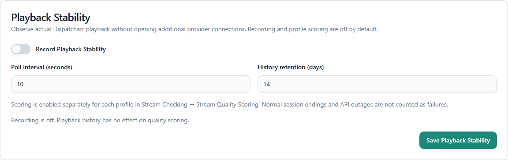
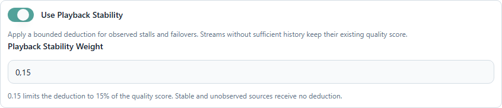

# Dev playback stability changelog — 2026-10-07

## Passive playback evidence

- Added an optional recorder using Dispatcharr's existing proxy status. It opens
  no additional IPTV/provider connection and preserves the existing authoritative
  status cache and viewer protection rules.
- Recording defaults to off for existing and new installations. Configuration is
  persisted in the existing SQLite database under `playback_stability`.
- Confirmed viewer sessions accumulate observed duration, byte-delivery stalls
  and source switches while the same viewer remains attached to the same channel
  session. Shadow watchers and identifiable StreamFlow clients are excluded.
- Ordinary session endings, retuning, API outages, observation gaps and byte
  counter resets do not count as failures. Initial tuning has a grace period;
  stalls require at least 30 seconds without byte progress after that period.
- History uses checkpointed rows in `playback_observations`, including during an
  active playback. Restarting preserves confirmed history without treating the
  unobserved restart interval as a failure. Long sessions rotate checkpoints every
  approximately ten minutes. Retention is evaluated using each checkpoint's last
  observed time, with a boundary overlap bounded by one checkpoint segment
  (ten minutes plus at most one valid sampling gap).
- Evidence is tied to the Dispatcharr stream ID and a hash of its source URL.
  Viewer identities, IP addresses, provider credentials and source URLs are not
  stored in the history. A changed URL cannot inherit an older source's evidence.
- All channels, including Teamarr channels, follow the same optional rules.
  Observations for the same source are combined across channels.

## Optional quality scoring

- Added `Use Playback Stability` and `Playback Stability Weight` to the profile
  editor's Stream Checking → Stream Quality Scoring section. Usage defaults to off
  and requires the global recording option to be enabled.
- A source needs at least 600 observed seconds and 60 valid samples inside the
  retention window before its stability can affect ordering.
- Stability is `max(0, 1 - stalled / observed) / (1 + failovers * 3600 / observed)`.
  The existing quality score is multiplied by
  `1 - playback_stability_weight * (1 - stability)`. The default optional weight
  is 0.15, limiting deductions to 15% of the existing quality score.
- Sources without sufficient evidence retain exactly the existing quality score;
  there is no default zero and no extra denominator weight. A measured stable
  source also retains its existing score. Playlist and resolution ordering modes
  keep their existing priority rules.
- Sequential and concurrent channel checks obtain one immutable evidence snapshot
  per channel. One-off source probes without a channel/profile remain unchanged.
- The legacy sequential retry retains its existing global quality weights. Its
  optional stability deduction is applied separately, so adding the feature cannot
  silently change that retry's baseline for an unobserved source.

## Settings and history

- Added Settings → Monitoring → Playback Stability, with an independent save action,
  `Record Playback Stability`, polling interval (5–60 seconds, default 10) and
  retention (1–30 days, default 14).
- Added a sanitized passive history table showing observed time, stall time,
  failovers and either a measured score or `Not enough data`. The API limits the
  display to the 200 most recently observed sources; scoring uses the full eligible
  history for the channel's assigned sources.
- Added `/api/playback-stability/config` (GET/PUT) and
  `/api/playback-stability/status` (GET). Invalid settings are rejected without
  overwriting the saved configuration. Disabled collection performs no polling
  and has no scoring effect.

## Measurement limits

- This observes delivery through Dispatcharr; it cannot detect a decoder freeze
  while bytes continue arriving or prove what a player displayed.
- A source switch with a continuously attached viewer is an observed failover,
  not proof of its underlying cause. Missing client/session/byte-counter metadata
  is ignored rather than inferred.
- Polling can miss interruptions shorter than its interval. The history describes
  observed playback, not every event between snapshots.

## Validation

- Initial focused backend coverage: 48 tests passed, including missing evidence,
  Teamarr parity, stalls, session changes, API outages, restart persistence, source
  replacement, retention, cross-channel aggregation and disable-during-poll races.
- Extended focused backend coverage: 55 tests passed, including real Flask routes,
  profile/config persistence and freshness/eligibility boundaries.
- Final expanded stable backend suite: 2,039 passed, one skipped;
  integration contracts: 57 passed, one skipped.
- Frontend: all 302 tests passed; production build passed. Six browser scenarios
  covered default-off settings, save/reload, independent profile opt-in, editable
  weight, master-off gating and isolated settings-load failures, with no page errors.
- Profile step buttons now expose accessible names and their selected state.
- Backend stable suite and integration contracts also passed on GitHub/Linux.

## Backend dependency audit

- GitHub's backend audit reported CVE-2026-102598 in the existing Werkzeug 3.1.8
  pin before reaching the test step. Updated the production and test locks to
  Werkzeug 3.1.9, retaining hash-verified installation. Release artifacts and
  SHA-256 hashes were checked against https://pypi.org/project/Werkzeug/3.1.9/.
- The existing frontend dependency audit is unchanged; no check is disabled.

## Live Unraid validation

- Built amd64 and arm64 images through the existing GitHub build workflow and
  updated the existing `streamflow` container through Unraid's native DockerMan
  `update_container` command. The GUI template points to
  `ghcr.io/bttfw/streamflow:streamflow-playback-stability-20261007`.
- Tested code revision: `f7a4abf78b01e140bcf67d42fdfa58a3e38b6d50`.
  Host configuration, mounts, GPU/runtime options, network binding and the
  environment hash matched the previous container. A consistent SQLite backup
  and template backup were created before deployment.
- Confirmed the initial global default was off. Enabled recording through the
  real Settings UI, verified persistence after reload and checked independent
  profile opt-in/weight controls. Both UI runs completed without page errors.
- Observed an existing real playback for 601.5 seconds with 61 confirmed samples.
  The source remained unscored before the eligibility boundary and then reached
  a stability value of 1.0, with zero observed stalls and failovers. The existing
  viewer stayed attached throughout the observation.
- Resolved this persisted real source history through the deployed scoring
  snapshot and confirmed that a measured stable source receives no deduction.
  No provider connection or channel update was issued by the scoring verification.
- Exercised deployed Linux tracker/repository/scoring modules against an isolated
  in-memory database: a simulated unstable source scored 0.77 while a stable source
  and an unobserved source both retained their 0.90 quality score. API outage,
  global disable and equal Teamarr handling were also checked. Synthetic data
  was never written into the live playback history.
- Verified profile persistence through the live API with a disabled, unassigned
  temporary profile; removed that test profile afterward.
- Restored the original global settings through the UI: recording off, ten-second
  interval, fourteen-day retention. Existing profiles were not opted into scoring.
- The deployed runtime used Python 3.11.17 and Werkzeug 3.1.9. SQLite quick-check
  passed; startup/observation logs contained no tracebacks, import errors or
  recorder poll errors.

### UI references

The following are cropped screenshots of the actual Unraid-hosted interface;
they contain no viewer identity, provider URL or connection credentials.

