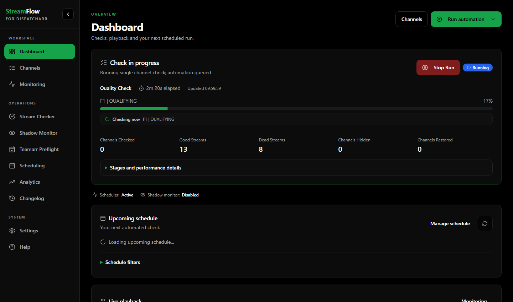
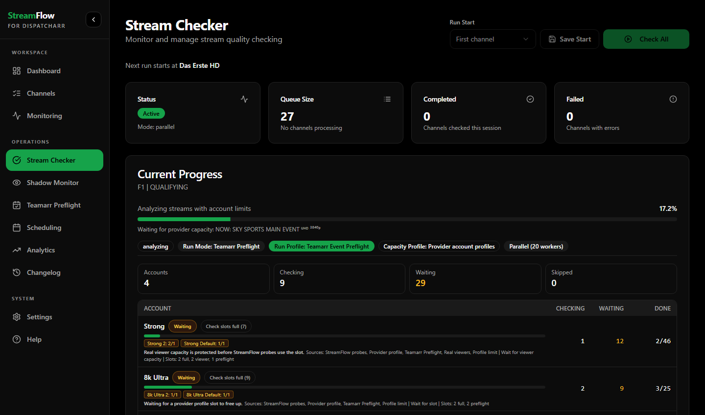
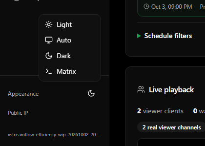
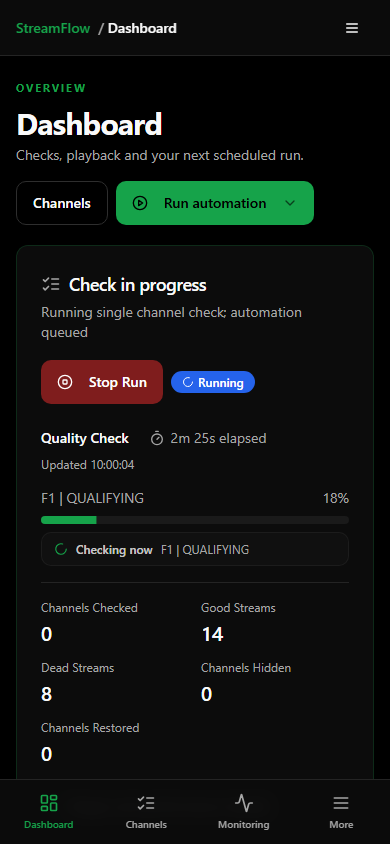
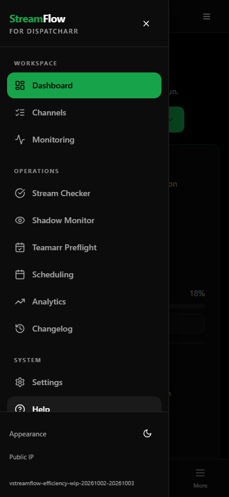

# Matrix appearance

Additional color-only appearance based on black/charcoal surfaces and green
accents. Layout, typography, spacing, corner radius and operational behavior
retain the existing values.

## Palette

| Use | Color |
| --- | --- |
| Page background | `#000000` |
| Cards and sidebar | `#0c0c0c` |
| Popovers | `#101010` |
| Primary, progress and focus | `#16a34a` |
| Text on primary surfaces | `#000000` |
| Main text | `#fafafa` |
| Secondary text | `#a6a6a6` |
| Secondary surfaces | `#1a1a1a` |
| Borders | `#242424` |
| Input borders | `#2e2e2e` |

Dark text on the green primary surfaces provides approximately 6.38:1
contrast at full opacity. Main and secondary text on cards provide
approximately 18.73:1 and 8.01:1 respectively. These are palette calculations,
not a rendered UI accessibility audit.

Green accents belong to navigation, primary actions, progress and focus.
Warnings, errors, information and provider states keep their semantic colors.

## Integration

- Visible entry: sidebar `Appearance` theme menu -> `Matrix`.
- Stored value: existing `localStorage.theme` key with value `matrix`.
- Effective mode: `dark`; root classes: `dark matrix` so existing dark variants
  continue to apply. Matrix does not follow the system appearance.
- Returning to Light, Dark or Auto removes `matrix`. Auto continues to follow
  the system preference using the existing listener and cleanup.
- Existing CSS custom properties carry the palette. Theme-specific rules
  remove the blue body gradient and color the selected sidebar navigation
  item without changing its structure.
- No new packages, backend endpoints or server settings are required.

## Validation - 2026-10-03

All 295 existing frontend tests passed across 39 files, and the production
frontend build passed. Browser validation of that build, using read-only live
API data, passed 47 checks with no page exceptions or backend mutation requests.
It covered all pairs of appearance selections, reload persistence, Auto system
changes, Matrix isolation from system changes, keyboard menu closure, computed
palette/selected navigation colors, unchanged layout axes, four pages and mobile
navigation/theme switching.

The [amd64/arm64 image build](https://github.com/bttfw/streamflow/actions/runs/37107403968)
passed at `bf5ddba644c15df49bafa7f7c55e8319927acf84`. Native Unraid DockerMan
updated the existing container through its GUI-editable template after a
consistent SQLite/config and template backup. The deployed container is healthy
and ready; host configuration, network, mounts and environment values match the
pre-update snapshot.

All 47 browser checks passed again against that deployed image, with no page
exceptions or backend mutation requests. Desktop and 390-pixel mobile captures
were visually reviewed. They use actual live data; IP text is masked before
capture. These review artifacts are outside the application image.

Backend stable/integration and both CodeQL checks passed for the theme commit.
The [frontend CI job](https://github.com/krinkuto11/streamflow/actions/runs/37107370737/job/111158435690)
stopped at the unchanged high-severity dependency audit before its test/build
steps. The existing Tailwind 3 dependency chain contains `braces <=3.0.3`,
covered by [GHSA-vfj7-8cjw-p6xm](https://github.com/advisories/GHSA-vfj7-8cjw-p6xm).
At validation time the advisory lists no patched version. Local frontend tests,
the production build, the image build and deployed browser checks passed; this
does not make the dependency audit pass. No dependency migration or audit-gate
change is included in this color-only update.

## Deployed UI screenshots

Desktop Dashboard, including the existing Channels Restored metric:

Stream Checker with actual Teamarr Preflight work and provider capacity states:

Appearance selector:

Mobile Dashboard and navigation at 390 pixels

