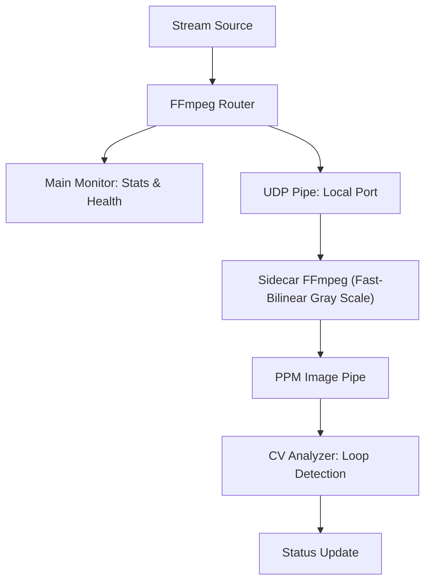
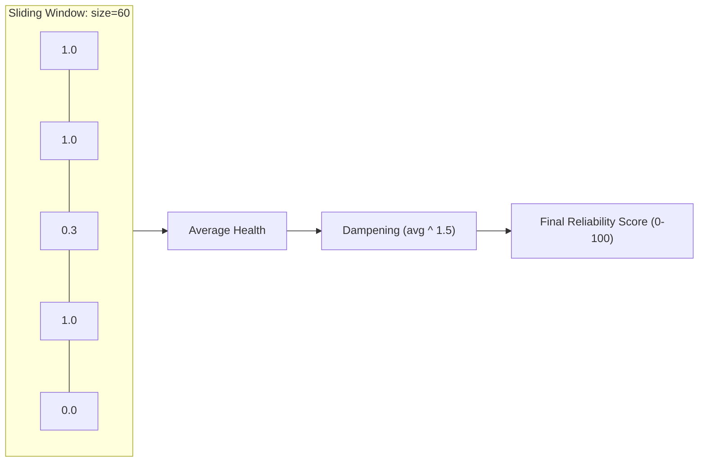
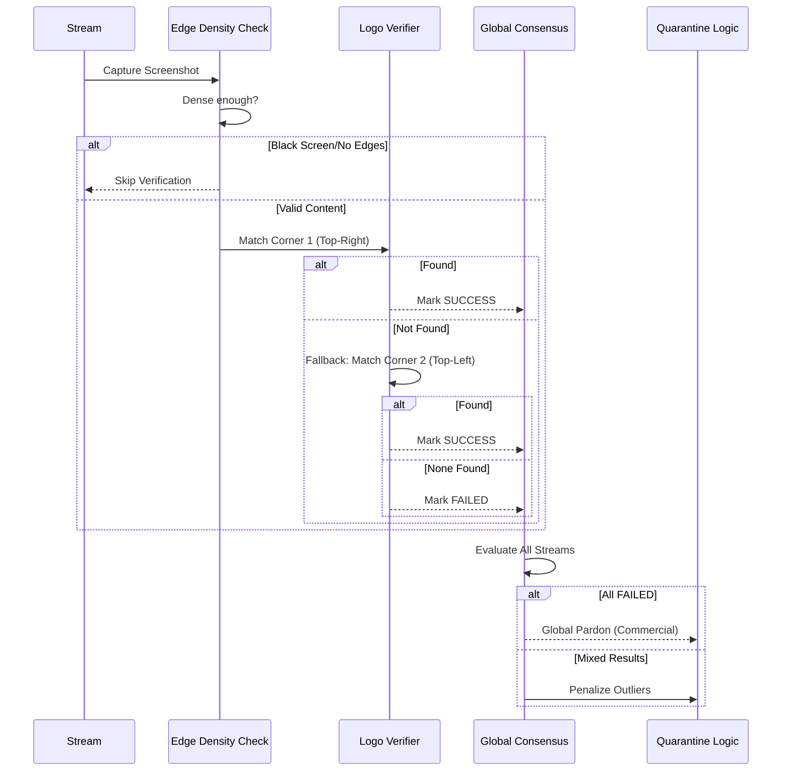

# Stream Monitoring

## Overview
Stream Monitoring is a live health tracking system that runs independently of the main automation pipeline. It maintains a session for each active stream and continuously evaluates quality, reliability, and content accuracy using a multi-layered approach.

---

## 1. FFmpeg Router & Sidecars
The system employs an efficient "Main + Sidecar" architecture for each monitored stream:

- **Main Monitor (`backend/apps/stream/ffmpeg_stream_monitor.py`)**: Captures high-level telemetry like bitrate, FPS, and speed. It uses health monitoring outputs to detect buffering or terminal failures.
- **Sidecar Detectors**: Specialized processes spawned alongside the main monitor to perform computationally intensive tasks without blocking the telemetry loop.

### Sidecar Mechanism Workflow

---

## 2. Looping Detection Mechanism
The loop detector analyzes frames in the PPM pipe. It maintains a short-term buffer of frame signatures (simplified as grayscale signatures) and checks for repeating sequences that indicate a stream is "looping".

- **Penalty**: 50 points are deducted from the reliability score immediately upon loop detection.
- **Quarantine**: If a stream is confirmed to be looping, it is marked as looping and moved to quarantine.

---

## 3. Stability Score: Capped Sliding Window
Reliability is measured using the **Capped Sliding Window** algorithm. This ensures that scores reflect recent performance while dampening sudden variance to prevent "flapping" in Dispatcharr.

### Scoring Mechanism
- **Healthy Measurement**: Stream alive + Speed > 0.9x = **1.0 points**
- **Buffering Measurement**: Stream alive + Speed < 0.9x = **0.3 points**
- **Dead Measurement**: Stream dead = **0 points**

---

## 4. Logo Detection: 4-Pillar Architecture
The logo verification system ensures the content matches the expected channel using a resilient 4-pillar CV system:
1. **Edge Density**: Skips verification on black screens or whip-pans to avoid false negatives.
2. **Multi-Corner Fallback**: Checks top-right; falls back to top-left if needed.
3. **Cross-Stream Consensus**: Grants a "Global Pardon" during commercial breaks if all streams fail simultaneously.
4. **Auto-Quarantine**: Outliers failing 4 consecutive checks are immediately quarantined.

---

## 5. Lifecycle: Quarantine & Review
- **Stable**: Reliable streams ranked by score and resolution.
- **Review**: Streams in "probation" after recovery or initial start.
- **Quarantined**: Streams showing wrong content or dead. Includes specific UI badges for `Looping` (with duration) and `Logo Mismatch` (with screenshot).

---

## 6. Efficiency & Stability
The system is optimized for high-performance monitoring:

- **Threaded Synchronization**: Rank updates to Dispatcharr are threaded to prevent blocking telemetry.
- **Log Debouncing**: Penalty warnings are throttled to 1/minute per stream.
- **Unified Evaluation**: Synchronized timestamps ensure metric alignment across the session.

---

## 7. Monitoring Dashboard & Visibility
- **Logo Verify Status**: Shows CV status (SUCCESS/FAILED/PENDING) and failure counts.
- **Quarantine Badges**: Shows specific reasons like `Looping (15.5s)` or `Logo Mismatch` (with failing screenshot).
- **Live Previews**: Horizontally-scrolling carousel of live screenshots across all active streams.

---

## 8. Session Types: FFmpeg vs OpenStream
A monitoring session has a **backend** (`session_type`) that decides how each stream's
reliability is measured. Both feed the same lifecycle, ranking and Dispatcharr
reordering. ffmpeg sources are scored by the Capped Sliding Window, OpenStream sources
by delivered share (below).

| | `ffmpeg` (default) | `openstream` |
|---|---|---|
| Source of truth | A local ffmpeg process decoding each stream | An [OpenStream](https://github.com/krinkuto11/openstream) server's swarm-health API |
| Measures | speed, bitrate, FPS, buffering; loop + logo CV | delivered share of the live stream, resolution/fps, download rate, peers/seeders, latency |
| Cost | One ffmpeg + CV sidecars **per stream** | One HTTP poll per OpenStream server every 2 s, for all its sources (no decode) |
| Screenshots / logo / loop | Yes | No (there are no decoded frames) |
| Best for | Any HTTP/HLS stream | **AceStream** channels served through an OpenStream gateway |

### How the OpenStream backend works
For an `openstream` session, each stream is handled by
[`OpenStreamStreamMonitor`](../backend/apps/stream/openstream_monitor.py), which
**duck-types the ffmpeg monitor**, so the lifecycle, Dispatcharr ordering and UI work
unchanged.

1. The 40-hex AceStream **content id** and the **server** are parsed from the
   Dispatcharr stream URL (`http://host:6878/ace/getstream?id=<id>` or the short
   `/<id>` form). No per-server configuration is needed.
2. Every monitor on the same OpenStream server shares one poller
   ([`openstream_hub.py`](../backend/apps/stream/openstream_hub.py)). Every 2 s it
   fetches all of its sources in **one** request (`GET /api/streams?ids=…`) over a
   keep-alive connection and hands each monitor its snapshot. Starting a monitor
   never touches the network, so a slow or unreachable server cannot stall the
   monitoring loop. With 100 sources (10 sessions × 10) this measured 0.5 requests/s,
   2 threads and 0.3% of a core, down from 47 requests/s, 47 new connections/s,
   101 threads and 4.5% with a thread per source.
3. Sources are **leased**, not pinned
   (`POST /api/streams {ids, lease: {owner: "streamflow/<session>", ttlSecs: 300}}`,
   renewed every 60 s). On stop the lease is released
   (`POST /api/actions {op: "release"}`), which never stops the stream itself.
   OpenStream's idle reaper ends it later, once nobody holds or watches it. So:
   - a viewer watching through Dispatcharr keeps watching;
   - the operator's warm pool is untouched;
   - a second session monitoring the same source keeps it.

   If Streamflow dies, its leases expire after 5 min. OpenStream servers from before
   leases are pinned and removed, as before.

**Ranking.** Each source's score (0–100) is the share of the live stream it actually
received over the last 5 minutes: the mean of `min(1, kbps / trueBitrateKbps)`.
It feeds the existing lifecycle (pass review at 70, 10-point switch hysteresis,
resolution tie-break within 5 points). The ffmpeg speed window is not used for
OpenStream sources.

The score was chosen empirically, against what a viewer of each pull received
(simulated players with 2/5/10 s caches). The data is two 80-minute runs on 25
different live sources during live events, picked on the first run and checked on
the second:

| Candidate ranking | Agreement with which source stalls next¹ | Viewer stall under Streamflow's ordering |
|---|---|---|
| Delivered share, 5 min (**used**) | **0.84** | 0.00 min/h (run 1), 0.07 (run 2), no switches |
| Previous healthy-poll window | 0.69 | 15.1 min/h (run 1), 0.07 (run 2) |
| OpenStream `reliabilityScore`, 5 min mean | 0.69 | 0.01 / 0.00 min/h |

¹ Pooled over both runs, 5 s cache, stalls in the next 5 min. The delivered share
ranked first in all six cache/horizon combinations tested.

At the pass-review threshold of 70, a source stayed stall-free for the next 5 minutes
87% / 91% of the time, against base rates of 66% / 90%.

The healthy-poll window failed because a source that stalls briefly and often looks
healthy most of the time: one source read healthy in 77% of polls while a viewer
stalled on it 137 times.

**Dead sources.** OpenStream reports `dead` after 20 s without any sign of life. That
isn't the end of the source: all 59 dead episodes recovered, the slowest after 182 s.
So a dead source is ranked down at once (it delivers nothing, so its score drops) but
only quarantined, and removed from Dispatcharr, after **300 s** of continuous `dead`.
Poll failures (server unreachable, API key refused) are never fatal, and never
trigger the monitor-restart timeout.

**Fields** (surfaced in the session view):

| StreamFlow field | Snapshot source | Meaning |
|---|---|---|
| `reliability_score` | delivered share, 5 min | the ranking score above |
| `width` / `height` / `fps` | `media` | source video format from OpenStream's probe; fps is the real frame rate (field-coded interlace counted in frames, matched ffprobe on 11/11 live sources). Feeds the resolution tie-break and the stats synced to Dispatcharr |
| `bitrate` | `health.trueBitrateKbps` | VBR-correct bitrate (the probe's `media.bitrateKbps` until health exists) |
| `download_kbps` | `kbps` | smoothed swarm download rate |
| `peers` / `seeders` | `peers` / `seeders` | connected peers, and those feeding us |
| `swarm_reliability` | `health.reliabilityScore` | OpenStream's own blend, shown for reference |
| `latency_secs` | `behindLiveSecs` | delay behind the live edge. `health.latencySecs` agrees within 0.7 s (median) when steady, but reads 0 or up to 46 s off while warming or stalled, so it is only the fallback |
| `swarm_state` | `health.state` | `warming`/`healthy`/`draining`/`stalled`/`storm`/`dead` |

The ffmpeg-only slow-speed quarantine does **not** apply: keep-up margin is not
playback speed.

**Authentication.** OpenStream's `/api` requires a login. Stream playback
(`/ace/getstream`) does not. Create an API key in OpenStream under
*Settings → API Keys* and enter it in StreamFlow under *Settings → Connection →
OpenStream* (or set `OPENSTREAM_API_KEY` / `OPENSTREAM_API_KEY_FILE`). **Test
Connection** checks the key against a server URL. The monitor sends the key as
`X-API-Key` on every call, and picks up a changed key within 30 s. If OpenStream
refuses a request, the stream shows why:

- 401: the key is wrong or revoked.
- 403: no key is set.
- 428: OpenStream's first-run setup isn't done.

Like an unreachable server, a refusal is never fatal. Sources stay in the
not-yet-healthy state and recover on their own once the key is fixed.

> **Requires the full OpenStream *server*** (`cmd/server`, e.g. `compose.server.yml`),
> which serves the `/api/*` control plane. The gateway-only `openstream serve`
> (`compose.openstream.yml`) exposes just `/ace/getstream`, so the health poll 404s
> and every source shows a permanent keep-up of 0.

**Choosing it:** in *Create Monitoring Session*, set **Monitoring Backend →
OpenStream swarm health** (the CV detection toggles hide, since they don't apply).
Or pass `"session_type": "openstream"` to `POST /api/stream-sessions`.
