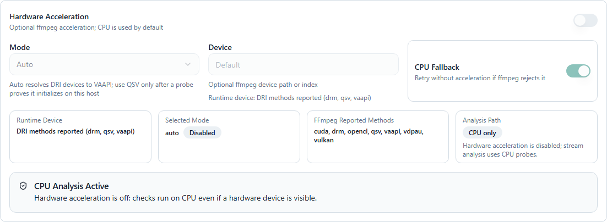

# StreamFlow on Unraid

The [Docker template](../templates/streamflow.xml) installs the stable StreamFlow
image through Unraid DockerMan. Community Applications listing is pending
submission and review.

StreamFlow requires an existing Dispatcharr instance reachable from its container.

## Install with DockerMan

Until the template is listed in Community Applications, save
`templates/streamflow.xml` from this repository as
`/boot/config/plugins/dockerMan/templates-user/my-streamflow.xml` on Unraid.
If that filename already exists, keep the existing user template and save this
one with a different `my-` filename.

1. Open **Docker -> Add Container** and select **streamflow** under the user
   templates.
2. Use a unique container name if another StreamFlow instance already exists.
3. Review **WebUI Port** and **Appdata**. The defaults are host port `5000` and
   `/mnt/user/appdata/streamflow`. Separate installations need separate ports
   and data directories.
4. Expand **Show more settings** and review **PUID** and **PGID** if your share
   permissions require different IDs. Defaults are `99:100`.
5. Click **Apply**, then use the container's **WebUI** action.
6. Complete StreamFlow's setup wizard with the reachable Dispatcharr address and
   your credentials. `localhost` inside this bridge-network container refers to
   StreamFlow itself.
7. Wait for initial synchronization and startup to complete before scheduling
   work. Starting with StreamFlow 2.7.1, the required background workers start
   after successful setup without a container or host restart.

The `/app/data` mapping persists the database, configuration, regex rules and
playback history across container recreation. Keep this mapping when updating.
Change the host port in DockerMan; the container's HTTP port remains `5000`.

## Updates and development builds

Use the normal **Docker -> Check for Updates -> Update** flow. Port, storage and
other container settings remain editable through **Docker -> Edit**.

The default repository is `ghcr.io/krinkuto11/streamflow:latest`. To test a
development build, edit **Repository** to
`ghcr.io/krinkuto11/streamflow:dev`. The template also declares `dev` as an
alternate branch for Community Applications. Review development changes before
updating and keep a filesystem copy of your persistent data before changing
release tracks.

## Optional GPU acceleration

The template uses CPU probing by default. GPU acceleration can help decode
streams during quality analysis; network requests and some detection filters
still use the CPU. The GPU must be supported by the host driver and the image's
FFmpeg build. Keep **Privileged** off.

### NVIDIA

1. Install/configure the **Nvidia-Driver** plugin from Unraid's Apps tab, following
   its instructions. Under **Settings -> Nvidia Driver**, confirm the GPU is
   detected and copy its GPU UUID.
2. Open **Docker -> StreamFlow -> Edit** and switch to **Advanced View**. Append
   `--runtime=nvidia` to **Extra Parameters**, keeping any existing parameters.
3. Use **Add another Path, Port, Variable, Label or Device**, choose **Variable**,
   and add these keys and values:

   | Key | Value |
   | --- | --- |
   | `NVIDIA_VISIBLE_DEVICES` | The GPU UUID from the plugin, or `0` for the first GPU |
   | `NVIDIA_DRIVER_CAPABILITIES` | `compute,utility,video` |

4. Click **Apply**. This recreates the container with its saved Appdata mapping.
5. Enable acceleration in StreamFlow as described below; select **CUDA** or
   **Auto**, with **Device** left blank for the default exposed GPU.

The variables and runtime follow the
[Unraid GPU guide](https://unraid.net/blog/unraid-6-9-capture-encoding-and-streaming-server)
and [NVIDIA's container documentation](https://docs.nvidia.com/datacenter/cloud-native/container-toolkit/latest/docker-specialized.html).

### Intel or AMD through DRI/VAAPI

1. Confirm the Unraid host has a working GPU driver and a render device under
   `/dev/dri`, such as `/dev/dri/renderD128`. Device numbering can differ.
2. Open **Docker -> StreamFlow -> Edit**. Use **Add another Path, Port, Variable,
   Label or Device**, choose **Device**, and set **Value** to `/dev/dri`.
3. If the render device only allows its owning group to access it, set **PGID**
   under **Show more settings** to that numeric group ID. You can read it in the
   Unraid terminal with `stat -c '%g' /dev/dri/renderD128`; use your actual node.
   Review the Appdata share permissions before changing the group: the image
   assigns its persistent files to the configured PUID/PGID at startup.
4. Click **Apply**, then select **VAAPI** or **Auto** in StreamFlow. Set **Device**
   to the actual render-node path, for example `/dev/dri/renderD128`.

Availability depends on the GPU, codec and driver. **QSV** is an Intel option
that should only be selected after a successful probe on that host. FFmpeg
listing a method does not prove that the device can decode a stream.

### Enable and verify in StreamFlow

1. Open **Stream Checker -> Stream Checker Configuration -> Edit -> Stream
   Analysis** and find **Hardware Acceleration**.
2. Enable **Hardware Acceleration**, choose the mode/device for your GPU, keep
   **CPU Fallback** enabled, and click **Save Configuration**.
3. Run one targeted quality check and inspect the hardware status and logs for
   initialization errors or CPU fallback before running a large batch.

Where to find the acceleration settings

To return to CPU probing, disable **Hardware Acceleration** and save. You can
also remove the GPU device/variables and NVIDIA runtime parameter through
DockerMan, preserving the port and Appdata mapping. See the
[hardware acceleration guide](operations-guide.md#hardware-acceleration) for
further details.

For application support, use [GitHub issues](https://github.com/krinkuto11/streamflow/issues).

## Community Applications submission

The public repository contains an Apache-2.0 license, `ca_profile.xml` and one
Docker application template at `templates/streamflow.xml`. The profile, icon,
screenshots, project and support URLs refer to this repository. Screenshots use
example data.

After these files are merged into `main`, sign in to the
[Community Applications submission portal](https://ca.unraid.net/submit/new)
with an Unraid account and enter `https://github.com/krinkuto11/streamflow`.
Run **Validate** and **Scan**, resolve any reported issues and submit the
repository for review. The template's canonical raw URL must be publicly
reachable on `main` before submission.

The catalog scan and moderation decision are separate from local XML checks and
the DockerMan installation test. Do not describe StreamFlow as available in
Community Applications until its listing is published.
